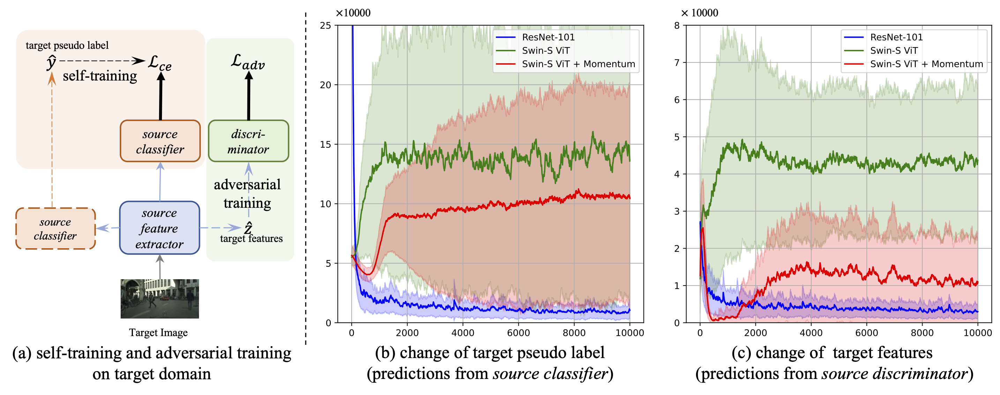
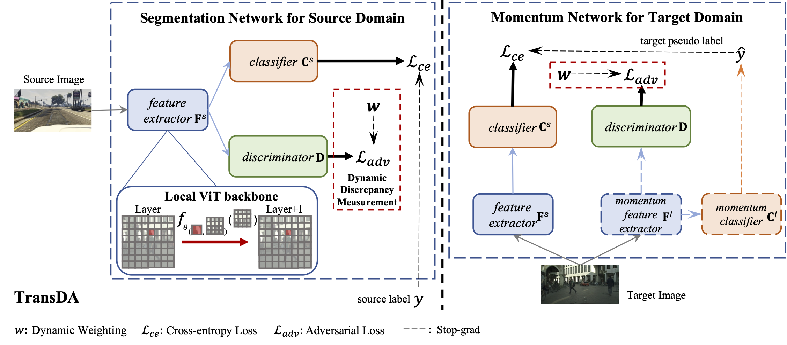
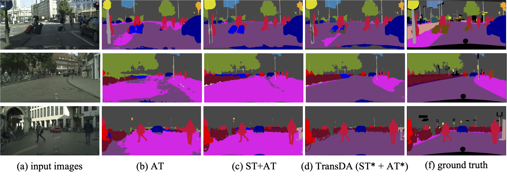
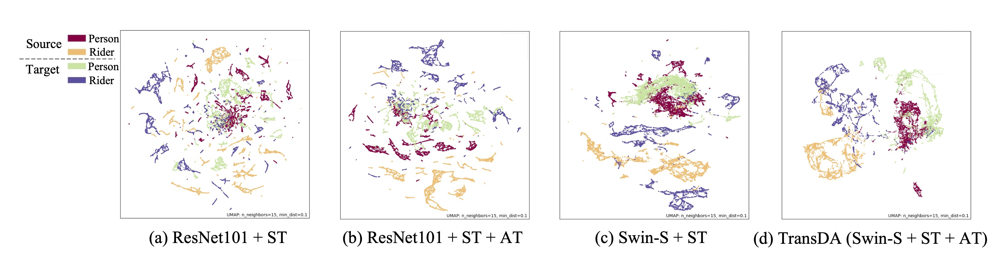

# Smoothing Matters: Momentum Transformer for Domain Adaptive Semantic Segmentation

This repo contains the supported code and configuration files to reproduce semantic segmentaion results of [TransDA](https://arxiv.org/abs/2203.07988). 

### [Paper](https://arxiv.org/abs/2003.00273) 

> **Smoothing Matters: Momentum Transformer for Domain Adaptive Semantic Segmentation**<br>
>
> **Abstract** *After the great success of Vision Transformer variants (ViTs) in computer vision, it has also demonstrated great potential in domain adaptive semantic segmentation. Unfortunately, straightforwardly applying local ViTs in domain adaptive semantic segmentation does not bring in expected improvement. We find that the pitfall of local ViTs is due to the severe high-frequency components generated during both the pseudo-label construction and features alignment for target domains. These high-frequency components make the training of local ViTs very unsmooth and hurt their transferability. In this paper, we introduce a low-pass filtering mechanism, momentum network, to smooth the learning dynamics of target domain features and pseudo labels. Furthermore, we propose a dynamic of discrepancy measurement to align the distributions in the source and target domains via dynamic weights to evaluate the importance of the samples. After tackling the above issues, extensive experiments on sim2real benchmarks show that the proposed method outperforms the state-of-the-art methods.*

## Author
Runfa Chen, Yu Rong, Shangmin Guo, Jiaqi Han, Fuchun Sun, Tingyang Xu, Wenbing Huang


<div align="center">
  
</div>

<div align="center">
  
</div>

## Citation
If you find this code useful for your research, please cite our paper:

```
@misc{chen2022smoothing,
    title={Smoothing Matters: Momentum Transformer for Domain Adaptive Semantic Segmentation},
    author={Runfa Chen and Yu Rong and Shangmin Guo and Jiaqi Han and Fuchun Sun and Tingyang Xu and Wenbing Huang},
    year={2022},
    eprint={2203.07988},
    archivePrefix={arXiv},
    primaryClass={cs.CV}
}
```

### Prerequisites
- Python 3.8
- Pytorch 1.7.1
- torchvision from master
- yacs
- tqdm
- matplotlib
- GCC >= 4.9
- OpenCV
- CUDA >= 10.1
- mmcv >= 1.3.0
- cityscapesscripts


### Getting started

- Download [The GTA5 Dataset]( https://download.visinf.tu-darmstadt.de/data/from_games/ )

- Download [The SYNTHIA Dataset]( http://synthia-dataset.net/download/808/ )

- Download [The Cityscapes Dataset]( https://www.cityscapes-dataset.com/ )

- Symlink the required dataset
```bash
ln -s /path_to_gta5_dataset datasets/gta5
ln -s /path_to_synthia_dataset datasets/synthia
ln -s /path_to_cityscapes_dataset datasets/cityscapes
```

- Generate the label statics file for GTA5 and SYNTHIA Datasets by running 
```
python datasets/generate_gta5_label_info.py -d datasets/gta5 -o datasets/gta5/
python datasets/generate_synthia_label_info.py -d datasets/synthia -o datasets/synthia/
```

The data folder should be structured as follows:
```
├── datasets/
│   ├── cityscapes/     
|   |   ├── gtFine/
|   |   ├── leftImg8bit/
│   ├── gta5/
|   |   ├── images/
|   |   ├── labels/
|   |   ├── gtav_label_info.p
│   ├── synthia/
|   |   ├── RAND_CITYSCAPES/
|   |   ├── synthia_label_info.p
│   └── 			
...
```


### Train & Validate & Test
We provide the script using 4 Tesla V100 GPUs. 

TransDA-S
```
bash bin_small.sh
```
TransDA-B
```
bash cls_base.sh
```


### Visualization results




### Acknowledgments
Some codes are adapted from [FADA](https://github.com/JDAI-CV/FADA) and [Swin Transformer for Semantic Segmentaion](https://github.com/SwinTransformer/Swin-Transformer-Semantic-Segmentation). We thank them for their excellent projects.

